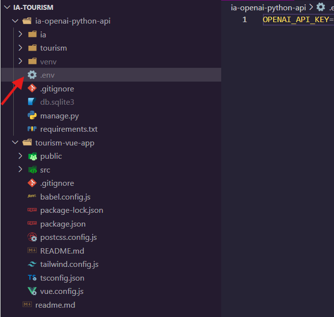
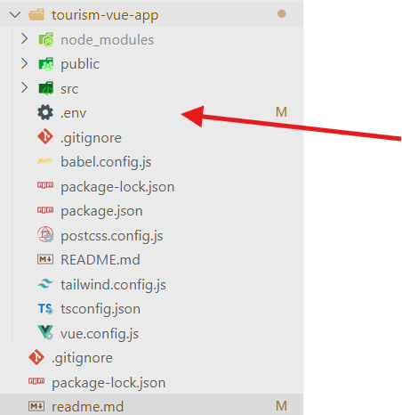

# Proyecto de Asistente Virtual de Turismo en Ecuador

Este proyecto tiene como objetivo desarrollar un asistente virtual de turismo enfocado en Ecuador, utilizando la inteligencia artificial de OpenAI. El asistente virtual proporcionará información y recomendaciones sobre destinos turísticos, actividades, alojamientos y más.

## Tecnologías utilizadas

- Backend: Python y Django
- Frontend: Vue.js 3

## Cómo levantar el proyecto

### Backend

1. Clona el repositorio desde GitHub:

```
git clone git@github.com:AndersonParra01/ia-tourism.git
cd tu-repositorio/backend
```

2. Crea un entorno virtual:

```
python -m venv venv
```

3. Activa el entorno virtual:

- En Git Bash en Windows:

  ```
  source venv/Scripts/activate
  ```

- En Command Prompt en Windows:

  ```
  venv\Scripts\activate
  ```

- En PowerShell en Windows:

  ```
  .\venv\Scripts\Activate
  ```

- En macOS/Linux:

  ```
  source venv/bin/activate
  ```

4. Instala las dependencias:

```
pip install -r requirements.txt
```

5. Configura la base de datos y realiza las migraciones:

```
python manage.py makemigrations
python manage.py migrate
```

6. Levanta el servidor backend:

```
python manage.py runserver
```

7. Accede al servidor de desarrollo del backend:

```
http://127.0.0.1:8000/
```

### Frontend

1. Instala las dependencias del frontend:

```
cd ./tourism-vue-app
npm install
```

2. Levanta el servidor frontend:

```
npm run serve
```

3. Accede a la aplicación en tu navegador:

```
http://localhost:8080
```

## Colaboración

Si deseas colaborar en este proyecto, sigue los pasos anteriores para clonar y levantar el proyecto en tu entorno local. Luego, puedes realizar cambios, agregar nuevas funcionalidades y enviar pull requests para revisión.

## Recuerda agregar el archivo `.env` en el backend y el frontend.




## Se adjunta el video de levantamiento del proyecto y las variables de ENTORNO UTILIZADAS

[Link - Video de levantamiento del aplicativo y su funcionamiento](https://drive.google.com/file/d/1RE-hHhV1n2JioV6dHoNqAxMf7lJUgUOY/view)

[Link - variables de entorno `.env` ](https://drive.google.com/drive/folders/10cFbgwKae7ZBiWGGPfkz_N_BfL04No1p?usp=sharing)

[Link - Informe ](https://docs.google.com/document/d/10iPMjzTr1vUxkhIEHxBdDy-ACK74_ZZs/edit?usp=sharing&ouid=106201933481073490667&rtpof=true&sd=true)
